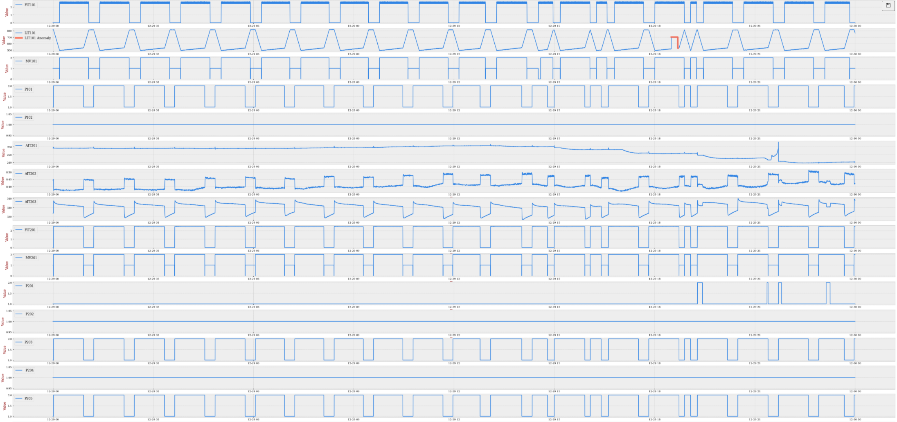
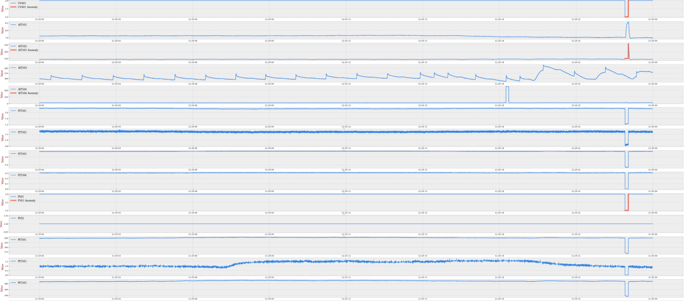
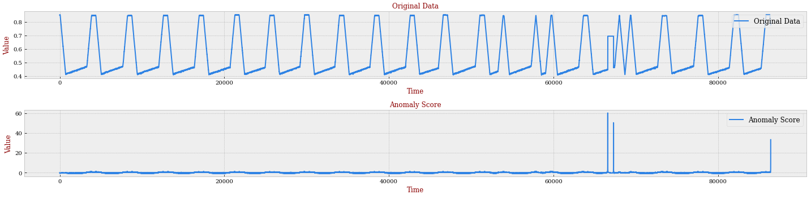
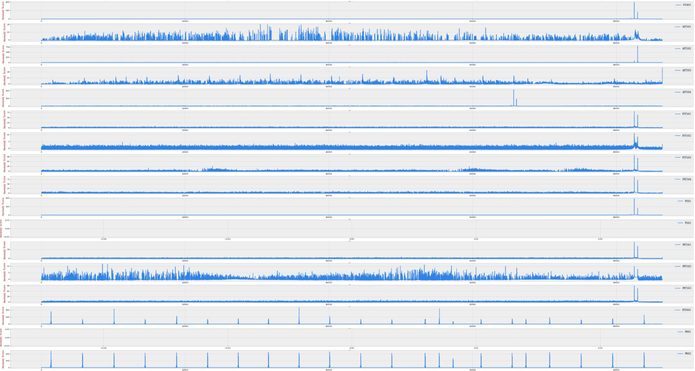

# 📊 iTrust SWaT Dataset Preprocess Tool

This is a tool for iTrust SWaT dataset preprocessing, including dataset details introduction, dataset visulization, dataset processing and some pytorch utils. 

## 💡 Introduction

iTrust Secure Water Treatment (SWaT) dataset is a famous and widely used dataset, mostly in anomaly detection field. For more details about this dataset, please refer to the official site for SWaT dataset: [https://itrust.sutd.edu.sg/testbeds/secure-water-treatment-swat/](https://itrust.sutd.edu.sg/testbeds/secure-water-treatment-swat/)

Since SWaT is originally collected dataset, by using it, we should do some preprocessing. Here we provide a tool to help you do this. Here we mostly forcus on SWaT 2015 dataset since it provides more clear attack informations. About other years data, we will keep updating. Here are features about our tool. 

Features: 

- Data visulization: we visulized the dataset, with marking anomaly parts, which is clear to check data patterns. 
- Excel tools: we provide some tools to help you read excel elegantly, like reading attack lists and return attacks within what period you choose. 
- Spectral residual preprocessing: since the SWaT dataset has obvious cycle pattern, we apply spectral residual method to help us remove redundancy. 
- Pytorch dataset class: we provide pytorch dataset class, can be applied in time-series anomaly detection trainning. 

## 🔧 Environment 

``` 
Python Version: 3.6 or later
Python Packages: jupyterlab, torch, numpy, pandas, matplotlib, sklearn
```

## 📁 Structure

```
.
├── data/
│   ├── swat-2015-data.csv
│   ├── swat-2015-data.npy
│   └── swat-2015-attack.xlsx
├── fig
├── notebook/
│   ├── swat-2015-info.ipynb
│   ├── swat-2015-process.ipynb
│   └── swat-2015-dataset.ipynb
├── src/
│   ├── silency.py
│   └── util.py
└── README.md
```

- `data/`: all dataset files will be here
    - `swat-2015-data.csv`: original dataset, transferred from xlsx file
    - `swat-2015-data.npy`: transferred dataset
    - `swat-2015-attack.xlsx`: original attack information
- `fig/`: result figures will be here
- `notebook/`: preprocess in notebook format
    - `swat-2015-info.ipynb`: introduction about the dataset, including basic information and visulization
    - `swat-2015-process.ipynb`: main preprocess on the dataset, including normalization and SR method
    - `swat-2015-dataset.ipynb`: about using the torch dataset class tool
- `script/`: preprocess in script format
- `src/`: source code of tools 

## 📖 How to start

**Step 0.** Before everything, please follow the `data/README.md` to get the dataset file. This may take one or two days. 

**Step 1.** [Clone]() or [Download]() this repository.

**Step 2.** Check `notebook/swat-2015-info.ipynb` to get a basic idea about the dataset. More details are included in the notebook. 

**Step 3.** Check `notebook/swat-2015-process.ipynb` to preprocess the dataset, including normalization, format transformation, spectral residual, simple anomaly detection, etc. More details are included in the notebook. 

**Step 4.** Check `notebook/swat-2015-dataset.ipynb` to check generated torch dataset. More details are included in the notebook. You can also use the `src/swatset.py` to do that. 

**Step 5.** Freely use scrpts in your projects! 

## 📋 Examples

**1.** Visulization for the original dataset (here shows part of, P1 & P2). Orange lines mean anomaly part. 




**2.** Visulization for the original datset (P4 & P5). Orange lines mean attacks. 



**2.** Spectral on one feature as an example. The upper one is the feature data before processing, the down one is value after SR processing. It's much easier to show the attack. 



**3.** Spectral on all dataset features. To check the performance, we can compare this fiture with the original data. 



## 📚 References

[1]. Hou, Xiaodi, and Liqing Zhang. **"Saliency detection: A spectral residual approach."** *2007 IEEE Conference on computer vision and pattern recognition.* Ieee, 2007.
